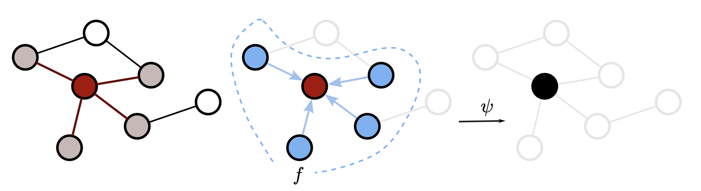

# Node classification using Graph Neural Networks (GNNs)

Recently, deep learning methods showed significant performance in various research fields, including computer vision and natural language processing. Graph Neural Network approaches have been specifically designed to take advantage of these great performances while applying them to graphs.  
Learning information about object and their relations is done by following a **message passing framework**, where node representations $h_{u}^{l}$ of all nodes $u \in \mathcal{V}$ of a graph $\mathcal{G}=(\mathcal{V}, \mathcal{E})$ are iteratively updated by aggregating information from their local neighborhood $\mathcal{N}(u)$:

$$h^{l+1}_{u} = \psi \biggl(h_{u}^{l}, f(h_{v}^{l}:v \in \mathcal{N}(u))\biggl)$$

In the above formulation, $f$ denotes an aggregation function of the node representations, and $\psi$ an update function.  
Considering the toy graph in the image below, a graph neural network model updates a node (e.g the red node) by:  
- selecting all its neighbors, i.e grey nodes  
- aggregating information from them (using $f$) - this information can be contained in node feature  
- updating the (red) node representation (using $\psi$)

|  |
|:--:|
| <b>Message passing framework</b>|

## Objective

This tutorial will teach you how to use **Graph Neural Networks** for **node classification** tasks. For this purpose, we will use [Scikit Network library](https://scikit-network.readthedocs.io/en/latest/), which is a Python package for the analysis of large graphs. It implements several graph algorithms (clustering, classification, ranking) as well as a Graph Neural Networks module. The whole package is based on efficient graph representation through **sparse** matrices (using [Scipy](https://scipy.org/)) and it is designed to be super easy to implement.

## Context

This tutorial and poster have been presented for the [LTCI](https://www.telecom-paris.fr/en/research/laboratories/information-processing-and-communication-laboratory-ltci)-day2022 (Information processing and communication laboratory, Télécom Paris, France).